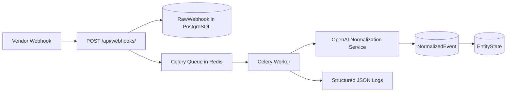

# AI Webhook Ingestion and Normalization Platform

Production-grade webhook ingestion platform built with Django, DRF, PostgreSQL, Redis, Celery, and OpenAI.

## Architecture



## Core Design Decisions

- Fast webhook acceptance: endpoint persists raw payload and returns `202` without waiting for OpenAI.
- Durable raw payloads: every accepted request is stored exactly as received.
- Idempotency-first ingestion:
  - Prefer vendor `external_event_id` when available.
  - Fallback to deterministic SHA-256 hash of canonicalized payload.
  - Enforced with DB unique constraints.
- Async AI normalization: Celery worker classifies and maps payloads to canonical schemas.
- Out-of-order safety: `EntityState` updates only if new `event_time` is newer than current state.
- Failure isolation: retries with exponential backoff, terminal dead-letter status, and inspectable errors.

## Event Taxonomy

### Entity types

- `SHIPMENT`
- `INVOICE`
- `UNCLASSIFIED`

### Shipment canonical states

- `PICKED_UP`
- `IN_TRANSIT`
- `OUT_FOR_DELIVERY`
- `DELIVERED`

### Invoice canonical states

- `ISSUED`
- `PAID`
- `VOIDED`
- `REFUNDED`

## Data Model

### `RawWebhook`

- UUID primary key
- Vendor metadata (`vendor`, `external_event_id`)
- `idempotency_key`
- Exact `raw_payload`
- Lifecycle fields (`processing_status`, `retry_count`, `error_message`, `received_at`)
- Unique constraints for dedupe and re-delivery safety

### `NormalizedEvent`

- One-to-one with `RawWebhook`
- Canonical normalized fields (`entity_type`, `entity_id`, `canonical_status`, `event_time`)
- `normalized_payload` for explainability/signals
- `confidence_score`, `llm_model`, `prompt_version`

### `EntityState`

- One row per (`entity_type`, `entity_id`)
- Latest state projection with out-of-order protection via event timestamp comparison

## Async Workflow

1. Vendor sends JSON to `POST /api/webhooks/`.
2. API computes idempotency key and upserts `RawWebhook`.
3. API enqueues `process_raw_webhook` Celery task using `transaction.on_commit`.
4. Worker marks record `PROCESSING`, calls OpenAI, validates strict JSON response.
5. Worker saves `NormalizedEvent`, updates `EntityState` only if event is newer.
6. Worker sets status `NORMALIZED` or records failure (`FAILED`/`DEAD_LETTER`).

## Retry and Failure Strategy

- Retry class: transient OpenAI/network failures.
- Max retries: `5`.
- Backoff: `2^retries` seconds, capped.
- Dead-letter: events become `DEAD_LETTER` after max retries.
- All failures remain queryable in admin with replay support.

## Observability

- JSON structured logs.
- Correlation ID middleware (`X-Correlation-ID`) with propagation.
- Processing duration metrics (`duration_ms`) in acceptance and worker logs.

## Django Admin

Admin is enabled for all models with search/filter support:

- `RawWebhook`: search by ID/vendor/idempotency/error, filter by status/date.
- `NormalizedEvent`: filter by entity/status/prompt version.
- `EntityState`: filter/search by entity and status.
- Replay action: bulk replay for failed/dead-letter raw events.

## API

### Interactive API docs

- Swagger UI: `GET /api/docs/`
- ReDoc: `GET /api/redoc/`
- OpenAPI schema JSON: `GET /api/schema/`

### Health

`GET /api/health/`

Response:

```json
{"status": "ok"}
```

### Ingest webhook

`POST /api/webhooks/`

Headers (optional):

- `X-Webhook-Vendor: Maersk`
- `X-Correlation-ID: <uuid>`

Body: arbitrary JSON payload.

Response (`202 Accepted`):

```json
{
  "status": "accepted",
  "webhook_id": "f5b4f18b-703c-4bbd-9363-2cbb497fdb16"
}
```

### Replay webhook

`POST /api/webhooks/{id}/replay/`

Body (optional):

```json
{"force": true}
```

## Local Development

### Prerequisites

- Docker + Docker Compose

### Run

```bash
cp .env.example .env
docker compose up --build
```

Services:

- Django API: `http://localhost:8000`
- Admin: `http://localhost:8000/admin/`
- PostgreSQL: `localhost:5432`
- Redis: `localhost:6379`

## Example Requests

```bash
curl -X POST http://localhost:8000/api/webhooks/ \
  -H 'Content-Type: application/json' \
  -H 'X-Webhook-Vendor: Maersk' \
  -d @samples/maersk_shipment.json
```

```bash
curl http://localhost:8000/api/health/
```

## Prompt Versioning

- Prompt template is centralized in `apps/normalization/prompts.py`.
- Runtime prompt version is set with `NORMALIZATION_PROMPT_VERSION`.
- Persisted on every `NormalizedEvent` for reproducibility and audits.

## Scalability Considerations

- API and worker scale independently (`web` replicas vs worker concurrency).
- Redis queue decouples ingest spikes from normalization latency.
- DB indexes support high-volume lookups (`vendor`, status, event ID, entity projections).
- Idempotent writes prevent duplicate fan-out from vendor retries.

## Security and Production Roadmap

Current baseline includes throttling and structured error handling. Recommended next steps:

1. Add webhook signature validation per vendor (HMAC/public-key).
2. Add OpenTelemetry tracing exporters and Prometheus metrics endpoint.
3. Add queue partitioning by vendor/priority.
4. Add low-confidence review queue using `LOW_CONFIDENCE_THRESHOLD`.
5. Add S3/object-store archival of raw payload snapshots for long-term retention.
6. Harden authN/authZ for replay endpoint and admin.

## Project Layout

```text
config/
apps/
  ingestion/
  normalization/
  entities/
samples/
scripts/
Dockerfile
docker-compose.yml
.env.example
```
